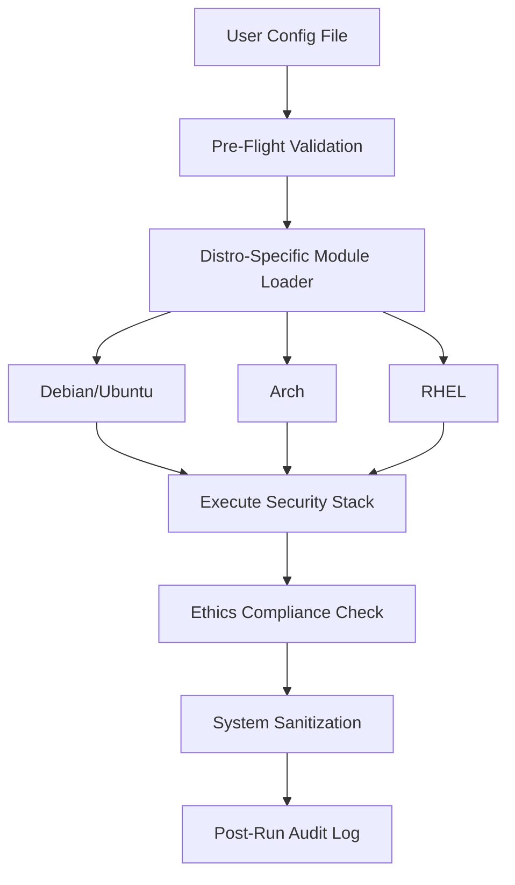

################################################################################
# Phantom‑0 v1.0.0 (Public Skeleton): High-assurance privacy hygiene and system integrity—quietly minimizing telemetry, metadata, and digital footprint.
################################################################################
> Privacy, security, and system hygiene toolkit — **for lawful, ethical use only.**
> This public skeleton contains **no anti-forensic code**. It provides a modular,
> distro‑agnostic framework (with the help of available users could extend this to distros that are currently not within this framework), an embedded ethics gate, and clear extension points so you can plug in your own lawful modules.

################################################################################
        **IMPORTANT - YOU MUST AGREE TO THESE TERMS & CONDITIONS**
################################################################################
    Phantom-0 is provided as a privacy, security, and digital hygiene framework for lawful, ethical use only.
By downloading, using, or modifying this software/tool, **YOU AGREE** to the following terms:

**1. Authorized Use Only**
    This software/tool is intended solely for lawful, ethical purposes, including but not limited to:
    • Personal use by individuals seeking enhanced privacy, digital hygiene, and security.
    • Educational and research use for learning about cybersecurity, privacy, and system hardening.
    • Organizational and industry use by businesses, nonprofits, and other entities to strengthen their security posture.
    • Professional use by IT/security practitioners for compliance, defensive hardening, and privacy protection.
    
**2. Prohibited Use**
    This software/tool must NOT be used for:
    • Harming others.
    • Malicious or unlawful intent.
    • Concealing, impeding, or destroying evidence.
    • Obstructing justice, investigations, or lawful seizure of property.
    • Any activity in violation of local, state, federal, or international law.
    
**3. No Warranty**
    This software/tool is provided “AS IS,” without warranty of any kind, express or implied. No guarantee is made regarding:
    • Functionality, reliability, fitness for a particular purpose, or security outcomes.
    • Compatibility with any system, distribution, or environment.
    
**4. Limitation of Liability**
    In no event shall the authors, contributors, or distributors of this software be liable for:
    • Direct, indirect, incidental, special, exemplary, or consequential damages.
    • Any claim, damages, or other liability, whether in contract, tort, or otherwise, arising from, out of, or in connection with this software or its use.
    
**5. User Responsibility**
    By using this software/tool, you accept full responsibility and liability for:
    • Compliance with all applicable laws, policies, and regulations.
    • Ensuring your use is lawful, ethical, and does not violate third-party rights.
    • All risks associated with installation, configuration, execution, or modification.
    
**6. Ethical Compliance**
    This project includes an Ethics Compliance Gate that requires acknowledgment before use. If you cannot comply with these conditions, do not use this software.

################################################################################
## Project Goals
################################################################################
- One-time download, self-contained folder; no cloud dependence.
- User-configurable directories and networking.
- Distro-agnostic module loader (Debian/Arch/RHEL families to start, other distros can be added but would need to be customized to that distros framework).
- Embedded Ethics Protocol (“311”) with on-by-default safeguards.
- Lightweight, offline plugin API (Mythic‑style extensibility) for optional CRM/cloud hooks **without** exfiltration or remote control.
- Clear separation between **public safe skeleton** and any **private modules** you may author for your environment.

################################################################################
## Quick Start
################################################################################
```bash
# 1) Unpack, enter the folder, review the ethics
less ETHICS.md

# 2) Configure (everything is opt‑in and DRY_RUN is on by default)
cp config/phantom0.conf.example config/phantom0.conf
$EDITOR config/phantom0.conf

# 3) (Optional) Lint and self-check
./tools/dev/check.sh

# 4) Try a dry run (does nothing destructive)
./phantomctl preflight
./phantomctl start --dry-run
./phantomctl shutdown --dry-run

# 5) (Optional) install systemd units (kept disabled by default)
sudo ./install.sh
```

################################################################################
## Flowchart
################################################################################


################################################################################
## Logs & Verification
################################################################################
After installation, you can confirm Phantom-0 actually executed on boot and shutdown by checking logs and service status:

- **View latest startup log:**
  ```bash
  sudo cat "$(ls -t /run/phantom0/logs/phantom0-startup_*.log | head -n 1)"
  ```

- **View latest shutdown log:**
  ```bash
  sudo cat "$(ls -t /run/phantom0/logs/phantom0-shutdown_*.log | head -n 1)"
  ```

- **Check service status:**
  ```bash
  systemctl status phantom0-startup.service
  systemctl status phantom0-shutdown.service
  ```

- **Enable services if they aren’t enabled:**
  ```bash
  sudo systemctl enable phantom0-startup.service
  sudo systemctl enable phantom0-shutdown.service
  ```

################################################################################
## Core Assets (mapped to modules)
################################################################################
1. **LUKS protection functions** → `modules/assets/luks.sh` (safe stubs; destructive ops disabled)
2. **Encrypted RAM logging system** → `modules/assets/ram_logging.sh` (tmpfs-backed logging)
3. **Journal encryption workflow** → `modules/assets/journal.sh` (placeholder flow; no secrets committed)
4. **Network rule obfuscation technique** → `modules/assets/net_rules.sh` (non-destructive demo hooks)
5. **/proc hiding method** → `modules/assets/proc_hiding.sh` (placeholder; not enabled in public build)

This repository ships **placeholders only** for sensitive behaviors. The public build is demonstrative & educational and **does not** implement anti-forensic behavior.

################################################################################
## Ethics, Safety & Compliance
################################################################################
- See **ETHICS.md** (Embedded Ethics Protocol “311”). Running `phantomctl` requires explicit user consent set in `config/phantom0.conf`.
- See **docs/fips.md** for a pragmatic path toward FIPS-aligned builds.
- See **SECURITY.md** for responsible disclosure.
- All modules ship **DRY_RUN=1** by default.

################################################################################
## Extensibility (Mythic‑style, offline)
################################################################################
- Drop executable hooks in `ext/plugins.d/` using a simple env-in/env-out contract. Examples in `ext/examples/`.
- No network calls are performed by default. Any plugin that adds network activity must be **opt‑in** and clearly documented.

################################################################################
## Repo Layout
################################################################################
```
.
├── ETHICS.md
├── LICENSE
├── README.md
├── SECURITY.md
├── CONTRIBUTING.md
├── CODE_OF_CONDUCT.md
├── phantomctl
├── install.sh
├── uninstall.sh
├── scripts/
│   ├── startup.sh
│   └── shutdown.sh
├── modules/
│   ├── common/
│   │   ├── utils.sh
│   │   ├── ethics_gate.sh
│   │   └── distro.sh
│   ├── distro/
│   │   ├── debian.sh
│   │   ├── arch.sh
│   │   └── rhel.sh
│   └── assets/
│       ├── luks.sh
│       ├── ram_logging.sh
│       ├── journal.sh
│       ├── net_rules.sh
│       └── proc_hiding.sh
├── config/
│   └── phantom0.conf.example
├── systemd/
│   ├── phantom0-startup.service
│   └── phantom0-shutdown.service
├── tools/
│   ├── dev/check.sh
│   └── version.sh
├── tests/
│   └── smoke.bats
├── ext/
│   ├── README.md
│   ├── plugins.d/.keep
│   └── examples/hello_plugin.sh
└── docs/
    ├── architecture.md
    └── fips.md
```

################################################################################
## Next Steps
################################################################################
- Paste your **PT1 / PT2** startup and **AA** shutdown scripts into `scripts/` and refactor into `modules/assets/*` using the stubs as guides.
- Keep sensitive behaviors behind `DRY_RUN` and **off** by default in public builds.
- When ready, tag a release with `tools/version.sh bump` and publish the zip to GitHub Releases.

---

**Notice:** This skeleton is provided _as-is_ for good-faith, lawful uses such as privacy hygiene, compliance, and research. It intentionally avoids providing evasion/anti-forensics code.


---

**Note:** Your original scripts are preserved under `scripts/original/`. Wrappers `scripts/startup-wrapper.sh` and `scripts/shutdown-wrapper.sh` auto-detect user/home, network interfaces, and distro, then execute the originals unchanged.


**Autodetect Upgrade:** Wrappers now use a private mount namespace to map legacy paths (e.g., /home/neo) to the real user home at runtime, keeping host paths private.


---

**Public Release Note:** `scripts/startup.sh` and `scripts/shutdown.sh` are now your full scripts sanitized with placeholders. Original ODT-derived versions remain preserved under `scripts/original/` for reference.
